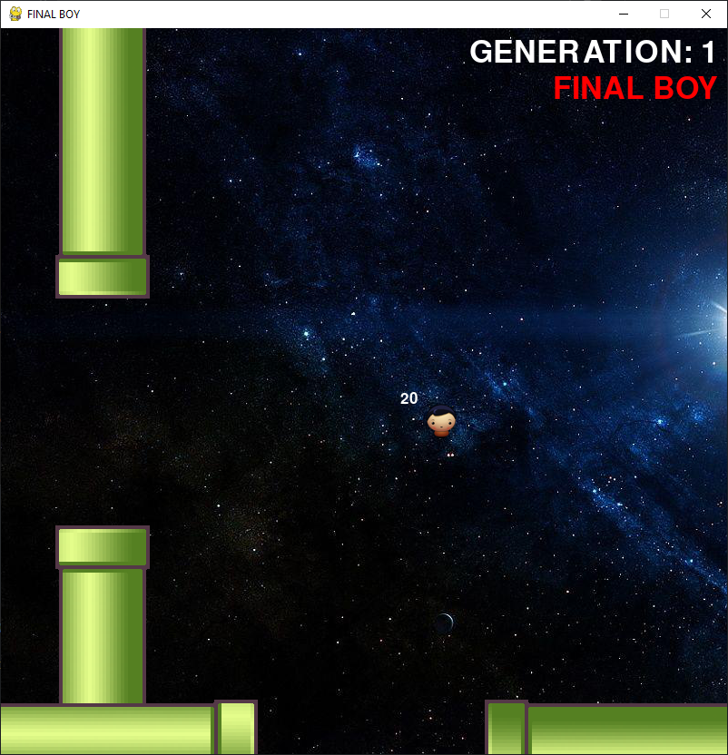

# Arbitrarily Evolved Neural Networks with NEAT-python

Learning environment is built with pygame

# Initial Setup

```shell
# Create Python virtual environment
$ python -m venv env
# Activate virtual environment
$ env\Scripts\activate
# Install dependencies
$ pip install -r requirements.txt
```

# Run game
```shell
$ python main.py
```


